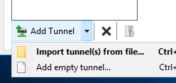
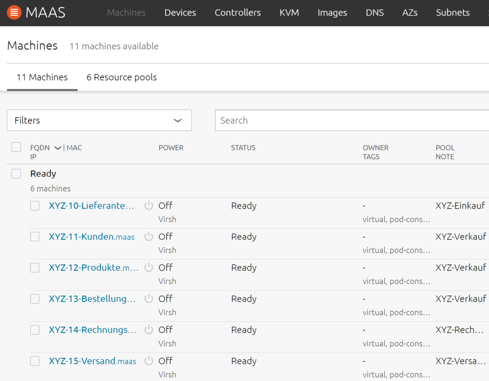
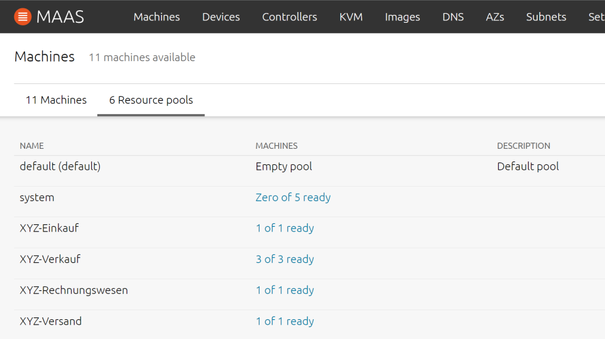
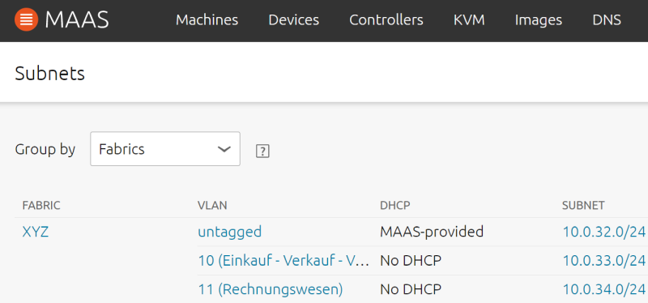
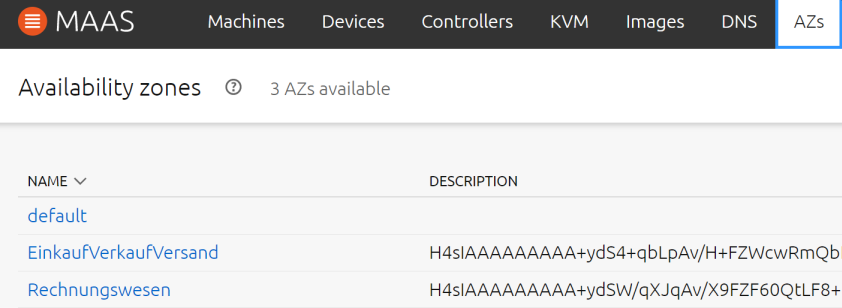
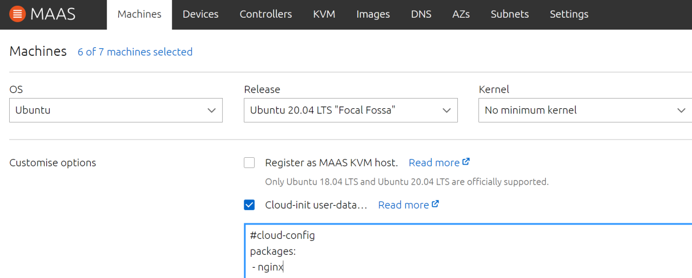
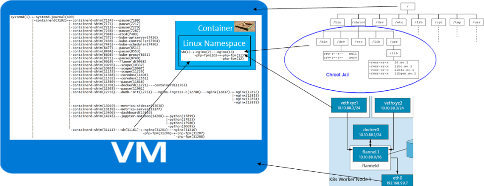
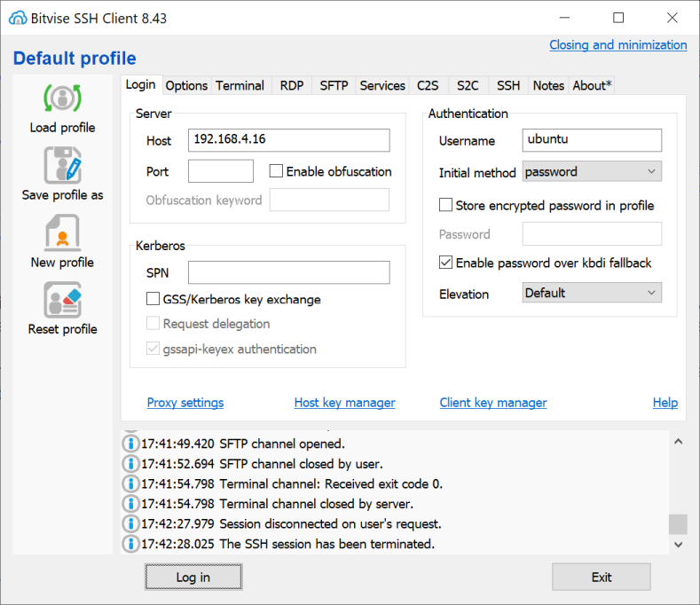

# Beispiele zum Kurs: [Von der Virtualisierung über Cloud und Container bis Serverless («VIRTAR»)](https://www.digicomp.ch/weiterbildung/development-trainings/software-engineering-trainings/it-architektur/softwarearchitektur/design-organisation/kurs-von-der-virtualisierung-ueber-cloud-und-container-bis-serverless)

Virtualisierung ist die Basistechnologie hinter den Cloud-Technologien und wird heute in unterschiedlichster Form in modernen ICT-Architekturen eingesetzt. Von VLAN (Virtual LAN) über VPN (Virtual Private Network) bis Cloud, Container und Serverless.

## Voraussetzungen

Der Kurs benötigt eine [lernMAAS](https://github.com/mc-b/lernmaas) Umgebung mit [MAAS](https://maas.io) ab Version 2.9.

Stellen Sie sich vor, Sie sind der IT-Administrator eines KMUs. Nennen wir es "Firma XYZ". 

Ihre Aufgabe ist es, ein flexibles Rechenzentrum für diese Einrichtung zu entwerfen. Sie haben beschlossen, mit MAAS als Tool Ihrer Wahl zu beginnen.
Nach dem Aufsetzen der [lernMAAS](https://github.com/mc-b/lernmaas) Umgebung mit ein paar KVM Maschinen und VPNs können Sie beginnen.

## Übungen

* [Infrastruktur](#Infrastruktur)
* [Funktionen](#Funktionen)
* [Ressourcenpools](#Ressourcenpools)
* [VLANs](#VLANs)
* [VPNs](#VPNs)
* [Infrastruktur als Code](#Infrastruktur-als-Code)
* [Linux Namespaces und Container](#Linux-Namespaces-und-Container)
* [Kubernetes](#Kubernetes)
* [Serverless](#Serverless)

### Infrastruktur

Als Infrastruktur wird die [lernMAAS](https://github.com/mc-b/lernmaas) Umgebung verwendet. 

Diese Implementiert eine Private Cloud und ist mittels VPNs (WireGuard) erreichbar.

**Das Vorgehen ist wie folgt:**

VPN [WireGuard](https://www.wireguard.com/install/) auf dem lokalen Notebook/PC installieren.

Vervollständigen der WireGuard Template Datei, z.B. `wg1-template.conf` mit Ihrer WireGuard IP-Adresse und dem privaten Key.

Dazu sind die Einträge <replace IP> und <replace Key> durch Ihre Werte, laut der Liste in den Unterlagen, zu ersetzen.

Die Konfigurationsdatei sieht in etwa so aus:

    [Interface]
    Address = <replace IP>/24
    PrivateKey = <replace Key>
    
    [Peer]
    PublicKey = xxxxxxxxxxxxxxxxxxxxxxxxxxxxxxxx
    Endpoint  = yyyyyyyyyyyyyyyyyy:518zz
    
    AllowedIPs = 192.168.xx.0/24

Starten Sie die WireGuard Software und fügen Sie die ergänzte WireGuard Vorlage als Tunnel hinzu:

Und aktivieren Sie den Tunnel:

Nun befinden wir uns im VPN, wo sich auch die [lernMAAS](https://github.com/mc-b/lernmaas) Umgebung befindet und können diese mittels [http://w.x.y.z:5240](http://w.x.y.z:5240) anwählen.

### Funktionen
***

> [⇧ **Nach oben**](#Übungen)

Die erstellten VMs pro Funktion
- - -

Wenn Sie mit den Mitarbeitern über die Anforderungen sprechen, erhalten Sie eine zufällige Liste von Funktionen bzw. Systemen:

* Lieferanten, Kunden, Produkte, Bestellungen, Rechnungsstellung, Versand

Sie beschliessen, für jede Funktion eine VM zu erstellen, jeweils mit Namen der Firma, der Funktion und einer fortlaufende Nummer.

Dabei verwenden Sie folgenden Aufbau:
* XYZ-10-Lieferanten
* XYZ-11-Kunden
* XYZ-12-Produkte
* XYZ-13-Bestellungen
* XYZ-14-Rechnungsstellung
* XYZ-15-Versand

Beim Aufsetzen der [lernMAAS](https://github.com/mc-b/lernmaas) Umgebung haben wir auch gleichzeitig [VM Hosts](https://maas.io/docs/snap/2.9/ui/adding-a-vm-host) erstellt.

Ein [VM Hosts](https://maas.io/docs/snap/2.9/ui/adding-a-vm-host) ist eine Maschine, auf der virtuelle Maschinen (VMs) ausgeführt werden. Standardmässig verwendet MAAS dazu [KVM](https://www.linux-kvm.org/).

Über den Tab `KVM` im MAAS UI ist zuerst ein VM Host auszuwählen und dort die VMs zu [erstellen](https://maas.io/docs/snap/2.9/ui/creating-and-deleting-vms#heading--add-vm-from-ui).

**Hinweis**: bei mehreren Mandanten verwenden Sie einen anderen Prefix als "XYZ" und beginnen die Nummerierung bei 20.

**Links**

* [Give me an example of MAAS](https://maas.io/docs/maas-example-config)

### Ressourcenpools
***
> [⇧ **Nach oben**](#Übungen)

Die Resourcenpools
- - -

Wenn Sie sich die Liste der von Ihnen erstellten Funktionen ansehen und mehr mit den Mitarbeitern sprechen, stellen Sie fest, dass einige dieser Funktionen enger zusammenpassen als andere. Mit etwas Aufwand erarbeiten Sie das folgende Update für Ihr Netzwerkdesign:

* **Einkauf**: Lieferanten
* **Verkauf**: Kunden, Produkte, Bestellungen
* **Rechnungswesen**: Rechnungsstellung
* **Versand**: Versandinformationen

Sie wissen, dass die Anzahl der Maschinen, die Sie für jede der einzelnen Funktionen benötigen, je nach den tatsächlichen Anforderungen der KMU variiert. 
Sie möchten jedoch lieber Maschinen für diese verschiedenen Funktionen budgetieren, damit Sie wissen, dass Sie die Anforderungen der einzelnen Funktionen erfüllen können. Der einfachste Weg, damit umzugehen? Erstellen Sie Ressourcenpools und benennen Sie sie nach den (neuen) Abteilungen (**fett**) in Ihrer Gliederung. Auf diese Weise können Sie eine bestimmte Anzahl von Maschinen für diese Funktionen reservieren und im Laufe der Zeit die richtige Anzahl von Maschinen bestimmen, die jeder Aktivität zugewiesen werden sollen.

Über den Tab `Machines` kommen wir zu den `Resource Pools`. Dort legen Sie die "**fett** markierten Abteilungen als [Resource Pools](https://maas.io/docs/snap/2.9/ui/resource-pools#heading--add-a-resource-pool) an.

Der `Resource Pool` kann anschliessend via `Pulldownmenu`, Spalte `Pool/Note` der VM zugewiesen werden.

**Tip**: bei mehreren Mandanten, lohnt es sich, dass Mandantenkürzel als `Tag` in den VM zu hinterlegen. Mit diesem `Tag` können dann alle VM eines Mandanten selektioniert werden.

### VLANs
***
> [⇧ **Nach oben**](#Übungen)

Getrennte Netzwerke mittels VLANs
- - -

*Ein Virtual Local Area Network (VLAN) ist ein logisches Teilnetz innerhalb eines physischen Netzwerks. Ein VLAN trennt physische Netze in Teilnetze auf, indem es dafür sorgt, dass VLAN-fähige Switches Frames (Datenpakete) nicht in ein anderes VLAN weiterleiten (obwohl die Teilnetze an gemeinsame Switches angeschlossen sein können).*

Von der Geschäftsleitung, ist der Wunsch gekommen, die Netzwerke für des Rechnungswesen vom Rest zu trennen.

Die traditionelle Art, diese Netzwerke zu trennen (ausser vollständig separate Netzwerke zu erstellen ), wäre ein VLAN. Glücklicherweise unterstützt MAAS mehrere VLANs. Wenn Sie Ihrem Design eine höhere Ebene hinzufügen, finden Sie sich mit dieser aktualisierten Netzwerktopologie wieder:

* **Einkauf, Verkauf, Versand**: Lieferanten, Kunden, Produkte, Bestellungen
* **Rechnungswesen**: Rechnungsstellung, Versandinformationen.

Die VLANs können über den Tab `Subnets` über `Add` angelegt werden. Erfasst werden muss ein Name (**fett**) und eine eindeutige Nummer zwischen 2 - 4094. Anschliessend sind die Subnetze, zu den VLAN zu erfassen. 

Die so definierten VLANs können dann den VMs über den Tab `Network` mittels `Add alias or VLAN zugewiesen werden.
 
### VPNs
***
> [⇧ **Nach oben**](#Übungen)

Getrennte Netzwerke mittels VPNs
- - -

*Das konventionelle VPN bezeichnet ein virtuelles privates (in sich geschlossenes) Kommunikationsnetz. Virtuell in dem Sinne, dass es sich nicht um eine eigene physische Verbindung handelt, sondern um ein bestehendes Kommunikationsnetz, das als Transportmedium verwendet wird. Das VPN dient dazu, Teilnehmer des bestehenden Kommunikationsnetzes an ein anderes Netz zu binden.*

In der [lernMAAS](https://github.com/mc-b/lernmaas) werden die VPN Informationen in [Availability zones (AZs)](https://maas.io/docs/snap/2.9/ui/availability-zones) hinterlegt.

Durch die Verwendung von mehreren VPNs können wir, wie bei VLANs, die Netzwerke trennen.

* AZ: **EinkaufVerkaufVersand**: Lieferanten, Kunden, Produkte, Bestellungen
* AZ: **Rechnungswesen**: Rechnungsstellung, Versandinformationen

Die `Availability zone` kann via `Pulldownmenu`, Spalte `Zone/Spaces` der VM zugewiesen werden.

Die Konfiguration der Notebooks/PCs erfolgt wie unter Punkt [Infrastruktur](#Infrastruktur) beschrieben.

Die Abteilung Rechnungswesen möchte zusätzlich Zugriff auf die VMs der anderen Abteilungen haben.

Das können wir durch eine Erweiterung der lokalen WireGuard Konfigurationsdatei erreichen, in dem wir eine zweite IP-Adresse (Interface) und einen zweiten Peer hinzufügen.

Die Konfigurationsdatei sieht in etwa so aus:

    [Interface]
    Address = 192.168.10.xx/24,192.168.11.xx/24
    PrivateKey = <replace Key>
    
    # 1tes VPN
    [Peer]
    PublicKey = xxxxxxxxxxxxxxxxxxxxxxxxxxxxxxxx
    Endpoint  = yyyyyyyyyyyyyyyyyy:518zz
    AllowedIPs = 192.168.10.0/24
    
    # 2tes VPN
    [Peer]
    PublicKey = xxxxxxxxxxxxxxxxxxxxxxxxxxxxxxxx
    Endpoint  = yyyyyyyyyyyyyyyyyy:518zz
    AllowedIPs = 192.168.11.0/24    
    
**Hinweis**: Auf dem WireGuard Gateway müssen die IP-Adressen den gleichen Public Key verwenden.  

### Infrastruktur als Code
***

> [⇧ **Nach oben**](#Übungen)

- - -

Infrastruktur als Code ist ein Paradigma (grundsätzliche Denkweise) zur Infrastruktur-Automation.

Es basiert auf konsistenten und wiederholbaren Definitionen (Code) für die Bereitstellung von Systemen und deren Konfiguration.

Produkte sind u.a. Puppet, Chef, Cloud-init, Vagrant, etc.

MAAS Unterstützt dieses Paradigma mittels [Cloud-init](https://cloudinit.readthedocs.io/en/latest/). 

Mittels selektionieren einer oder mehrere VMs und Anwahl des Pulldownmenus `Deploy` erscheint obiger [Dialog](https://maas.io/docs/snap/2.9/ui/custom-machine-setup#heading--cloud-init), wo ein Cloud-init Script angegeben werden kann.

Beispiel für Scripts sind:

    #cloud-config - Installiert den nginx Web Server
    packages:
     - nginx

- - -

    #cloud-config - Erstellt eine Intro Seite und installiert den Apache Web Server
    packages:
     - git
    runcmd:
     - git clone https://github.com/mc-b/lernmaas /home/ubuntu/lernmaas
     - git clone https://github.com/mc-b/virtar /home/ubuntu/virtar
     - cd /home/ubuntu/virtar
     - sudo bash -x /home/ubuntu/lernmaas/helper/intro
     - sudo cp -rp images /var/www/html/ 

**Links**

* [Offizielle Cloud-init Beispiele](https://cloudinit.readthedocs.io/en/latest/topics/examples.html)
* [lernMAAS und Cloud-init in der Public Cloud](https://github.com/mc-b/lernmaas/tree/master/doc/Cloud)

### Linux Namespaces und Container
***

> [⇧ **Nach oben**](#Übungen)

- - -

*Container sind ein altes Konzept und gehen bis auf die Anfänge von UNIX zurück. Sie basieren, vereinfacht, auf Linux Namespaces.*

Dazu benötigen wir zuerst eine VM mit Kubernetes und einem Container Runtime.

Dazu erstellen wir eine neue VM mit 2 CPU Cores, 4096 GB RAM und 16 GB Storage. Der Name der VM lautet `XYZ-16-kaas> (XYZ durch eigenes Kürzel ersetzen und Nummer durch eigenen Nummernbereich).

Deployt wird die VMs mit folgenden `Cloud-init` Script:

    #cloud-config
    users:
      - name: ubuntu
        sudo: ALL=(ALL) NOPASSWD:ALL
        groups: users, admin
        home: /home/ubuntu
        shell: /bin/bash
        lock_passwd: false
        plain_text_passwd: 'password'        
    # login ssh and console with password
    ssh_pwauth: true
    disable_root: false    
    packages:
      - unzip
    runcmd:
      - sudo snap install microk8s --classic
      - sudo usermod -a -G microk8s ubuntu
      - sudo microk8s enable dns storage ingress
      - sudo mkdir -p /home/ubuntu/.kube
      - sudo microk8s config >/home/ubuntu/.kube/config
      - sudo chown -f -R ubuntu /home/ubuntu/.kube
      - sudo snap install kubectl --classic      
      - export RELEASE=$(curl -s https://api.github.com/repos/kubeless/kubeless/releases/latest | grep tag_name | cut -d '"' -f 4)
      - microk8s kubectl create ns kubeless
      - microk8s kubectl apply -f https://github.com/kubeless/kubeless/releases/download/$RELEASE/kubeless-$RELEASE.yaml
      - cd /tmp; curl -OL https://github.com/kubeless/kubeless/releases/download/$RELEASE/kubeless_linux-amd64.zip && unzip kubeless_linux-amd64.zip
      - sudo mv /tmp/bundles/kubeless_linux-amd64/kubeless /usr/local/bin/
      - export HNC_VERSION=v0.7.0
      - export HNC_PLATFORM=linux_amd64
      - microk8s kubectl apply -f https://github.com/kubernetes-sigs/multi-tenancy/releases/download/hnc-${HNC_VERSION}/hnc-manager.yaml
      - curl -L https://github.com/kubernetes-sigs/multi-tenancy/releases/download/hnc-${HNC_VERSION}/kubectl-hns_${HNC_PLATFORM} -o /tmp/kubectl-hns
      - chmod +x /tmp/kubectl-hns
      - sudo mv /tmp/kubectl-hns /usr/local/bin
   
Das installiert zuerst [microk8s](https://microk8s.io/), die Kubernetes Distribution von Ubuntu. Dann [kubeless](https://kubeless.io/), ein Serverless Framework für Kubernetes. Und zum Schluss die Kubernetes Erweiterung für [Hierarchische Kubernetes Namespaces](https://kubernetes.io/blog/2020/08/14/introducing-hierarchical-namespaces/).

Nach der Installation, sind wir bereit Container zu starten. Dazu müssen wir uns mittels [Secure Shell (ssh)](https://de.wikipedia.org/wiki/Secure_Shell) mit der VM verbinden. Dazu eignet sich am besten [bitvise](https://www.bitvise.com/).

- - -

Nach der Installation von [bitvise](https://www.bitvise.com/) mit der IP und User `ubuntu` und Password `password` verbinden.

#### `unshare` - Alpine Linux in Linux Namespace betreiben

Dazu verwenden wir den Linux Befehl [unshare](http://manpages.ubuntu.com/manpages/bionic/man1/unshare.1.html) mit dem wir den Linux Namespace wechseln können und die Linux [Alpine](https://alpinelinux.org/) Distribution.

Das Beispiel holt Alpine Linux entpackt diese im Verzeichnis `myalpine` und wechselt mittels `unshare` 
den Linux Namespaces und setzt den Root `/` auf `myalpine`.

    mkdir myalpine
    cd myalpine
    wget https://github.com/alpinelinux/docker-alpine/raw/9f43992677cdb66a1ecbefe3bf409113b5f2127f/x86_64/alpine-minirootfs-3.12.3-x86_64.tar.gz -O - | tar xvzf -
    sudo cp /etc/resolv.conf etc/
    sudo unshare -p --fork --mount-proc -R . sh
    
Ab hier befinden wir uns im Container, mit eigenem Dateisystem und Prozesshierarchie    
    
    cat /etc/issue
    pstree -p -n                # schlägt fehl, kein ubuntu Linux
    pstree -p
    # weitere Software installieren
    apk update
    apk add vim
    
Um Schluss können wir den Container verlassen und zurück in die VM
    
    exit

#### `nsenter` - Wechsel in Linux Namespace des laufenden Containers

    kubectl run lieferanten --image dockercloud/hello-world --image-pull-policy="IfNotPresent" --restart=Never --labels="function=einkauf,mandant=xyz"
    sudo nsenter -t $(sudo lsns -t pid | tail -1  | awk '{ print $4 }') -a sh
    pstree -p  # Sicht innerhalb  des Containers (Namespace)
    ls -l
    cat /etc/issue
    exit
    kubectl delete pod/lieferanten

### Kubernetes
***

> [⇧ **Nach oben**](#Übungen)

Kubernetes in 5 Minuten auf YouTube

---

Durch die Verwendung von Kubernetes Namespaces und Container (Pods) können wir, die gleiche Umgebung mit Containern statt VMs, aufbauen:

* **Einkauf, Verkauf, Versand**: Lieferanten, Kunden, Produkte, Bestellungen
* **Rechnungswesen**: Rechnungsstellung, Versandinformationen.

- - -

    export MANDANT=xyz
    kubectl create namespace ${MANDANT}
    kubectl hns set ${MANDANT} --allowCascadingDeletion
    kubectl-hns create evv-${MANDANT} -n ${MANDANT}
    kubectl-hns create rw-${MANDANT}  -n ${MANDANT}
    
    export NAMESPACE=evv
    for func in lieferanten kunden produkte bestellungen
    do
        cat <<%EOF% | kubectl --namespace ${NAMESPACE}-${MANDANT} apply -f -
        apiVersion: v1
        kind: Pod
        metadata:
          labels:
            name: ${func}
            mandant: ${MANDANT}
          name: ${func}
        spec:
          containers:
          - image: dockercloud/hello-world
            name: ${func}
    %EOF%
            
       cat <<%EOF% | kubectl --namespace ${NAMESPACE}-${MANDANT} apply -f -            
        apiVersion: v1
        kind: Service
        metadata:
          labels:
            name: ${func}
            mandant: ${MANDANT}
          name: ${func}
        spec:
          ports:
          - port: 80
            protocol: TCP
            targetPort: 80
          selector:
            name: ${func}
    %EOF%
        cat <<%EOF% | kubectl --namespace ${NAMESPACE}-${MANDANT} apply -f -            
        apiVersion: networking.k8s.io/v1
        kind: Ingress
        metadata:
          labels:
            name: ${func}
            mandant: ${MANDANT}        
          name: ${func}
          annotations:
            nginx.ingress.kubernetes.io/rewrite-target: /
        spec:
          rules:
          - http:
              paths:
              - path: /${MANDANT}/${func}
                pathType: Prefix
                backend:
                  service:
                    name: ${func}
                    port:
                      number: 80        
    %EOF%
    done

Das Ergebnis können wir wie folgt anschauen:

    kubectl get pods,services,ingress --all-namespaces -l mandant=${MANDANT} -o wide

Und im Browser, in dem wir die URL https://<ip-cluster/${MANDANT}/lieferanten öffnen.

Um Schluss können wir die ganze Umgebung wieder löschen:

    kubectl delete namespace ${MANDANT}
    
### Serverless
***

> [⇧ **Nach oben**](#Übungen)

Einführung in kubeless

---

Was unseren Container fehlt, sind unterschiedliche Programme. Diese können auf die traditionelle Art, mittels Dockerfile erstellt werden oder mittels Function as a Service.

Wir entscheiden uns für Function as a Service und verwenden dazu Kubernetes mit dem Produkt [kubeless](https://kubeless.io/).

Dazu erstellen wir ein einfaches Script, zu Testzwecken, welches wir für alle Container wiederverwenden wollen.

    cat <<%EOF% >function.py
    def myfunction(event, context):
      print event
      return 'KMU Beispiel'
    %EOF%
    
Diese Function können wir nun für all unsere Container veröffentlichen:

    export MANDANT=xyz
    kubectl create namespace ${MANDANT}
    kubectl hns set ${MANDANT} --allowCascadingDeletion
    kubectl-hns create evv-${MANDANT} -n ${MANDANT}
    kubectl-hns create rw-${MANDANT}  -n ${MANDANT}    
    
    export NAMESPACE=evv
    export func="lieferanten"
    kubeless function deploy ${func} --runtime python2.7 \
                                     --from-file function.py \
                                     --handler ${func}.myfunction \
                                     --namespace ${NAMESPACE}-${MANDANT}

Die so erstellten Funktionen können wir anschauen mittels:

    kubeless function ls --namespace ${NAMESPACE}-${MANDANT}
    
Und die Funktion aufrufen:

    kubeless function call ${func} --namespace ${NAMESPACE}-${MANDANT}
   
Erstellt wurde ein Pod, ein Service und weitere Kubernetes Ressourcen welche wir wie folgt kontrollieren können:

    kubectl get pods,services --namespace ${NAMESPACE}-${MANDANT}
                        
Soll der Service, wie im vorherigen Beispiel, via URL erreichbar sein, brauchen wir noch eine Ingress Ressource. Laut Anleitung von kubeless sollte dies wie folgt funktionieren:

    kubeless trigger http create ${func} --path /${MANDANT}/${func} -n ${NAMESPACE}-${MANDANT} --function-name ${func}                                     
 
Leider wurde keine Ingress Ressource erzeugt weshalb wir auf auf YAML zurückgreifen müssen:

    cat <<%EOF% | kubectl --namespace ${NAMESPACE}-${MANDANT} apply -f -            
    apiVersion: networking.k8s.io/v1
    kind: Ingress
    metadata:
      labels:
        name: ${func}
        mandant: ${MANDANT}        
      name: ${func}
      annotations:
        nginx.ingress.kubernetes.io/rewrite-target: /
    spec:
      rules:
      - http:
          paths:
          - path: /${MANDANT}/${func}
            pathType: Prefix
            backend:
              service:
                name: ${func}
                port:
                  number: 8080        
    %EOF%
                                       
Das erzeugt die gewünschte Ingress Ressource und wir können die Ausgabe des Scripts im Browser via URL https://<ip-cluster/${MANDANT}/lieferanten anschauen.
